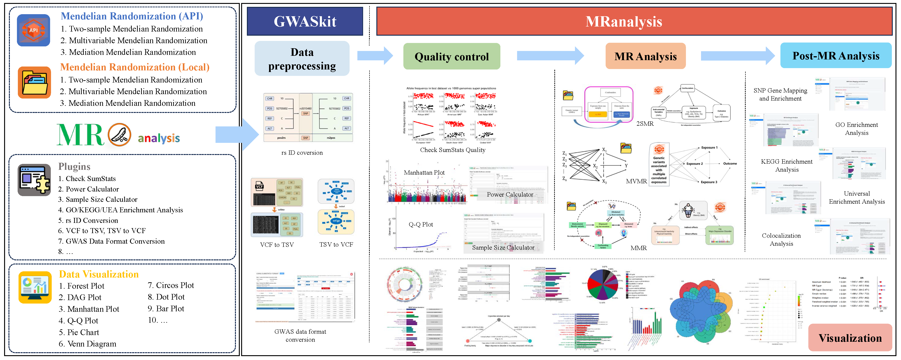
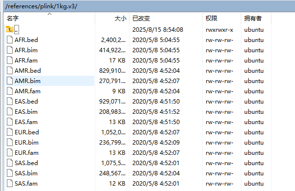
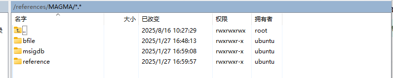
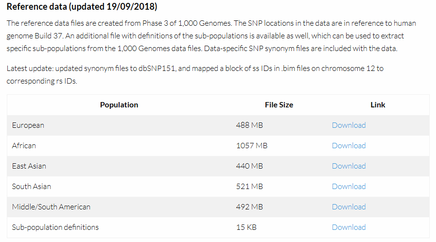
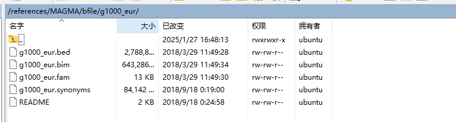
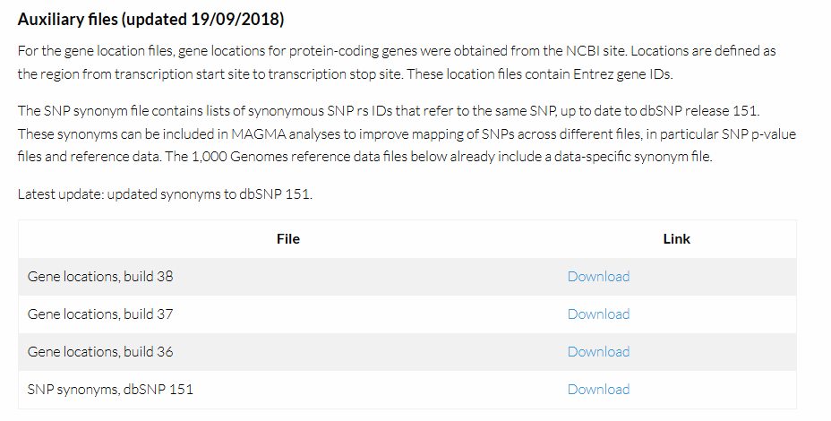
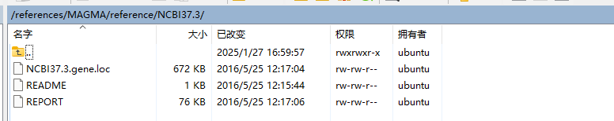
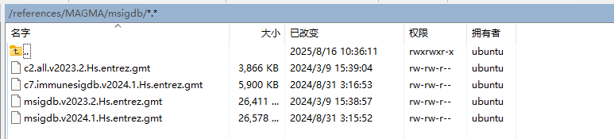
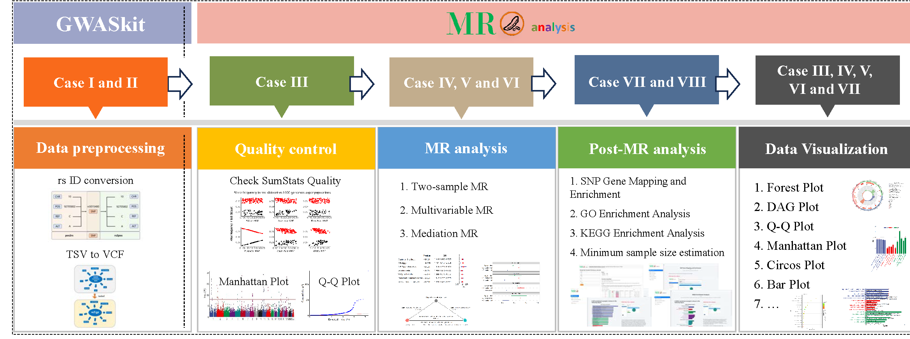
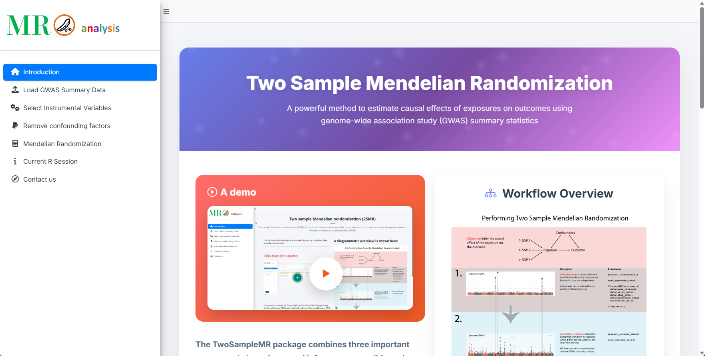

**[MRanalysis](https://mranalysis.cn/)** is an interactive R Shiny application designed for Mendelian randomization analysis.

# MRanalysis

**Mendelian randomization** (MR) has emerged as a powerful epidemiological method for inferring causal relationships between exposures and outcomes using **genome-wide association study** (GWAS) summary data. By leveraging instrumental variables (IVs), such as single nucleotide polymorphisms (SNPs), MR can revolutionize our understanding of disease etiology, inform public health strategies, and accelerate drug discovery.

However, the widespread adoption of MR is hindered by several challenges, including inconsistent GWAS data formats, lack of standardized workflows, the need for extensive programming expertise, and limitations in data visualization and interpretability. To address these challenges, we introduce **MRanalysis** , a comprehensive and user-friendly, web-based platform that provides the first integrated and standardized MR analysis workflow. This includes GWAS data quality assessment, power/ sample size estimation, MR analysis, SNP-to-gene enrichment analysis, and data visualization. **Built using the R shiny framework, MRanalysis enables users to conduct common MR methods, including univariable, multivariable, and mediation MR analyses through an intuitive, no-code interface** .

Besides MRanalysis, we developed **GWASkit** , a standalone, and installation-free tool facilitating rapid GWAS dataset preprocessing before MR analyses, including rs ID conversion, format standardization, and data extraction, with significantly lower conversion time and dramatically higher rs ID conversion accuracy than the current tools. Case studies demonstrate the utility, efficiency, and ease of use of our developed platform and GWASkit tool in real-world scenarios. By lowering barriers to investigating causal genetic relationships, our platform represents a significant advance in making MR more accessible, reliable, and efficient. The increased adoption of MR, facilitated by MRanalysis and GWASkit, can accelerate discoveries in genetic epidemiology, strengthen evidence-based public health strategies, and guide the development of targeted clinical interventions.



# Installation

## Use Docker (RECOMMENDATION)

MRanalysis is delivered as Docker images for consistent installations and executions to minimize any potential issues from user environment. **As such, a Docker running environment is required**. For Docker engine installation, user is referred to the Docker web site [https://docs.docker.com/install/](https://docs.docker.com/install/).

If a Docker running environment is not already available on the system, it will need to be installed. Docker is available in two editions: Community Edition (CE) and Enterprise Edition (EE). The following is an example for getting and installing Docker CE for Ubuntu/Debian systems. If a Docker running environment is already available on the system, these steps can be skipped and only the MRanalysis docker image would need to be installed.

### Step 1: Upload Software Repositories

As usual, it is a good idea to update the local database of software to make sure you've got access to the latest revisions.

Therefore, open a terminal window and type:

```shell
sudo apt-get update
```

Allow the operation to complete.

### Step2: Uninstall Old Versions of Docker

Next, it's recommended to uninstall any old Docker software before proceeding.

Use the command:

```shell
sudo apt-get remove docker docker-engine docker.io 
```

### Step 3: Install Docker 

To install Docker on Ubuntu, in the terminal window enter the command:

```shell
sudo apt install docker.io 
```

### Step 4: Start and Automate Docker

The Docker service needs to be set up to run at startup. To do this, type in each command followed by enter:

```shell
sudo systemctl start docker
sudo systemctl enable docker 
```

### Step 5: Running Docker as a non-root user

If you don't want to preface the `docker` command with `sudo`, create a Unix group called docker and add user to it:

```shell
sudo groupadd docker
sudo usermod -aG docker $USER 
```

### Step 6: Log out and log back in

After logging back in, run Docker as a non-root user.

After the installation of Docker of if you already have Docker environment, follow the steps below to install the MRanalysis docker image.

```shell
# Download the Docker image
wget https://mranalysis.cn/mranalysis.tar

# Load the downloaded Docker image
docker load -i mranalysis.tar
```

```shell
# Or use docker pull command pull image from docker Hub directly
docker pull xingabao/mranalysis:latest
```

### Run MRanalysis Container

Mount your reference data directory to the container. Ensure you have downloaded the required reference datasets (see [References](#References)).

```shell
docker run -itd --rm -p 8001:8001 --name mranalysis \
 -v /path/to/your/references:/references \
 -v /path/to/your/wkdir:/home/shiny \
 xingabao/mranalysis:latest
```

Access the platform at [http://127.0.0.1:8001](http://127.0.0.1:8001)

## Step-by-step manual installation

Follow these steps to manually install all required system dependencies, R packages, and third-party tools. Test in **Ubuntu:24.04**.

### Install R Environment

First, install R. On Ubuntu, run:

```shell
sudo apt-get update
sudo apt-get install -y r-base r-base-dev
```

For the latest R version, you may add the [CRAN repository](https://cran.r-project.org/bin/linux/ubuntu/) before installing. See the [official CRAN instructions](https://cran.r-project.org/bin/linux/ubuntu/) for details.

### Set Up Shiny Server on Ubuntu 24.04

```shell
sudo apt-get install -y gdebi-core
wget https://download3.rstudio.org/ubuntu-18.04/x86_64/shiny-server-1.5.20.1002-amd64.deb
sudo gdebi shiny-server-1.5.20.1002-amd64.deb
```

```shell
# Start, stop, or restart Shiny Server.
sudo systemctl start shiny-server
sudo systemctl stop shiny-server
sudo systemctl restart shiny-server
```

See details in https://posit.co/download/shiny-server/

### Install System Dependencies

Open a terminal and run:

```shell
sudo apt-get update
sudo apt-get install -y \
    cmake libxml2-dev libssl-dev libgmp-dev libharfbuzz-dev \
    libfribidi-dev libfreetype6-dev libpng-dev libtiff5-dev libjpeg-dev \
    git bzip2 libgsl-dev libglpk-dev libigraph-dev gcc-9 g++-9
```

Configure GCC alternatives:

```shell
sudo update-alternatives --install /usr/bin/gcc gcc /usr/bin/gcc-9 90 --slave /usr/bin/g++ g++ /usr/bin/g++-9
sudo update-alternatives --install /usr/bin/gcc gcc /usr/bin/gcc-13 130 --slave /usr/bin/g++ g++ /usr/bin/g++-13
```

### Install R Packages

Install required CRAN packages:

```shell
Rscript -e 'install.packages(c(
  "purrr", "tibble", "reactable", "ggplot2", "ggthemes", "ggdag",
  "ggpubr", "ggtext", "venn", "shinymeta", "esquisse", "openxlsx",
  "bs4Dash", "shinyalert", "shinyjs", "stringr", "spsComps", "colourpicker",
  "shinyvalidate", "shinyjqui", "sysfonts", "extrafont", "shinydashboard",
  "shinycssloaders", "formattable", "MendelianRandomization", "DT",
  "devtools", "BiocManager", "formatR", "coloc", "gdata", "logger",
  "Rfast", "Rmpfr", "pheatmap"
))'
```

Install required Bioconductor packages:

```shell
Rscript -e 'BiocManager::install(c(
  "clusterProfiler", "org.Hs.eg.db", "ComplexHeatmap",
  "VariantAnnotation", "MungeSumstats"
), update = FALSE, ask = FALSE)'
```

### Install Additional R Packages from GitHub

Set up your `GITHUB_PAT` environment variable if necessary.

Install specific versions and GitHub packages (you must fill in the actual download URLs):

```shell
# Install other GitHub packages
Rscript -e 'devtools::install_github("MRCIEU/CheckSumStats")'
Rscript -e 'devtools::install_github("qingyuanzhao/mr.raps")'
Rscript -e 'devtools::install_github("mrcieu/gwasglue")'
Rscript -e 'devtools::install_github("WSpiller/MVMR", build_opts = c("--no-resave-data", "--no-manual"), build_vignettes = FALSE)'
Rscript -e 'devtools::install_github("jrs95/geni.plots", build_vignettes = FALSE)'
Rscript -e 'devtools::install_github("boxiangliu/locuscomparer")'
Rscript -e 'remotes::install_version("RcppEigen", version = "0.3.3.9.3")'
Rscript -e 'remotes::install_github("jrs95/hyprcoloc", build_vignettes = FALSE)'
Rscript -e 'remotes::install_github("xingabao/MRanalysisBase")'
Rscript -e 'remotes::install_github("xingabao/GWASkitR")'
```

### Install Third-Party Tools

[PWCoCo](https://github.com/jwr-git/pwcoco), Pair-wise conditional analysis and colocalisation.

```shell
mkdir -p /tools
cd /tools
git clone https://github.com/jwr-git/pwcoco.git
cd pwcoco
mkdir build && cd build
cmake ..
make
```

[CAVIAR](https://github.com/fhormoz/caviar), a statistical framework that quantifies the probability of each variant to be causal while allowing with arbitrary number of causal variants.

```shell
cd /tools
git git clone https://github.com/fhormoz/caviar.git
cd caviar/CAVIAR-C++
sudo update-alternatives --set gcc /usr/bin/gcc-9
make
```

[bcftools](https://github.com/samtools/bcftools)

```shell
wget -O /tmp/bcftools-1.22.tar.bz2 https://github.com/samtools/bcftools/releases/download/1.22/bcftools-1.22.tar.bz2
tar -xvjf /tmp/bcftools-1.22.tar.bz2 -C /tools
cd /tools/bcftools-1.22
./configure --prefix=/tools/bcftools-1.22
sudo update-alternatives --set gcc /usr/bin/gcc-13
make -j
make install
```

[PLINK ](https://www.cog-genomics.org/plink/) is a free, open-source whole genome association analysis toolset, designed to perform a range of basic, large-scale analyses in a computationally efficient manner.

```shell
wget -O /tmp/plink_linux_x86_64.zip https://s3.amazonaws.com/plink1-assets/dev/plink_linux_x86_64.zip
mkdir -p /tools/plink
unzip /tmp/plink_linux_x86_64.zip -d /tools/plink
```

[MAGMA](https://cncr.nl/research/magma/): Generalized Gene-Set Analysis of GWAS Data

```shell
wget -O /tmp/magma_v1.10.zip https://vu.data.surfsara.nl/index.php/s/zkKbNeNOZAhFXZB/download 
mkdir -p /tools/magma_v1.10
unzip /tmp/magma_v1.10.zip -d /tools/magma_v1.10
```

Most commands require root or sudo privileges.

For additional configuration or troubleshooting, please refer to the documentation of each individual tool.

### Install and Run MRanalysis

```shell
# 1. Change permissions for the Shiny Server directory
chmod 777 /srv/shiny-server/

# 2. Move into the Shiny Server web directory
cd /srv/shiny-server/

# 3. Clone the MRanalysis repository
git clone https://github.com/xingabao/MRanalysis.git

# 4. Move all contents (including .git) to /srv/shiny-server root
mv MRanalysis/* .
mv MRanalysis/.git .

# 5. Copy required extdata files for MRanalysisBase
cp -r /usr/local/lib/R/site-library/MRanalysisBase/extdata /srv/shiny-server/XINGABAO

# 6. Restart Shiny Server to apply changes
sudo systemctl restart shiny-server
```

Access the platform at [http://127.0.0.1:3838](http://127.0.0.1:3838)

# References

The following reference datasets and files are required for the correct functioning of the tools in this pipeline. Please download them manually from their official sources or your institutional repositories.

## PLINK Reference Panel: **plink/1kg.v3**

 1000 Genomes Phase 3 reference panel in PLINK binary format (`.bed`, `.bim`, `.fam`). Used for quality control, LD pruning, and as a reference for genetic analyses. Please download from [http://fileserve.mrcieu.ac.uk/ld/1kg.v3.tgz](http://fileserve.mrcieu.ac.uk/ld/1kg.v3.tgz).

After downloading, please extract the archive into the `/references` directory, as shown below. This contains an LD reference panel for each of the 5 super-populations in the 1000 genomes reference dataset. e.g. for the European super population it has the following files: `EUR.bed`, `EUR.bim`, `EUR.fam`.



## MAGMA Reference Files

The **MAGMA reference directory** should contain the following three subdirectories, as shown below. `bfile`:  Contains binary reference panel files in PLINK format (**.bed**, **.bim**, **.fam**). `msigdb`:  Contains gene set files from the Molecular Signatures Database (MSigDB). `reference`:  Contains additional MAGMA reference files, such as gene annotation or location files.



a. `/references/MAGMA/bfile`. Binary reference panel files for MAGMA, typically in PLINK format (`.bed`, `.bim`, `.fam`). Used for gene and gene-set analysis in MAGMA. Please download from [https://cncr.nl/research/magma/](https://cncr.nl/research/magma/).



After downloading and extracting the files, place them into the specified directories as shown below:



b. `/references/MAGMA/reference`. Additional MAGMA reference files, such as annotation and gene location files. Used for mapping SNPs to genes and other MAGMA analyses. Please download from [https://cncr.nl/research/magma/](https://cncr.nl/research/magma/).



After downloading and extracting the files, place them into the specified directories as shown below:



c. `/references/MAGMA/msigdb`. Molecular Signatures Database (MSigDB) gene sets. Used in MAGMA gene-set enrichment analyses. Download from the [MSigDB](https://www.gsea-msigdb.org/gsea/msigdb) website.



# How to use MRanalysis

**MRanalysis** is an integrated online platform for Mendelian Randomization (MR) analysis and post-GWAS (Genome-Wide Association Study) workflows. It enables users -- especially those without programming experience -- to easily perform data preprocessing, various MR analyses, and rich result visualizations.



## Data Preprocessing

- **Using your own data:**  
  If you have GWAS summary statistics (CSV/TSV/VCF), it is recommended to preprocess the files using [GWASkit](https://github.com/Li-OmicsLab-MPU/GWASkit). GWASkit helps with tasks such as:
  - Format conversion (CSV/TSV ↔ VCF)
  - rs ID mapping (CHR:POS:REF:ALT ↔ rsID)
  - Standardizing GWAS data for MRanalysis

- **Using public datasets:**  
  MRanalysis can directly access and import GWAS summary data from public resources like the IEU OpenGWAS database via API.

## Quality Control (QC)

Before analysis, use the platform's QC tools to ensure data quality:
- **CheckSumStats:** Detect metadata errors and allele frequency inconsistencies.
- **Q-Q Plot and Manhattan Plot:** Visualize P-value distributions and check for significant associations or anomalies.

## MR Analysis

MRanalysis supports several MR analysis modes:
- **Univariable MR:** Standard exposure-outcome causal inference.
- **Multivariable MR:** Analyze multiple exposures simultaneously.
- **Mediation (Two-step) MR:** Assess mediation effects and indirect pathways.

You can upload your own preprocessed data or use built-in API mode to select public GWAS datasets. All analysis steps are code-free and parameters are user-friendly.

 ## Visualization and Results Interpretation

- Multiple visualization options available (forest plot, DAG, bar/dot/circos plot, etc.) for intuitive result presentation.
- SNP-to-gene mapping and GO/KEGG enrichment analysis are supported for functional interpretation.
- The platform provides complete code for every analysis, enabling transparency and reproducibility.

 ## Tutorials and Help

- Each function comes with **vedio** tutorials for step-by-step guidance.

  [https://mranalysis.cn/analysis/2SMR-api/](https://mranalysis.cn/analysis/2SMR-api/)

  **Click the image to watch a demo video of 2SMR-api**:

  [](https://mranalysis.cn/XINGABAO/intro/2SMR-api.mp4)

- Example datasets are available for practice and demonstration.

##  Access

- **Online platform:** [https://mranalysis.cn](https://mranalysis.cn)
- **GWASkit tool & documentation:** [https://github.com/Li-OmicsLab-MPU/GWASkit](https://github.com/Li-OmicsLab-MPU/GWASkit)

